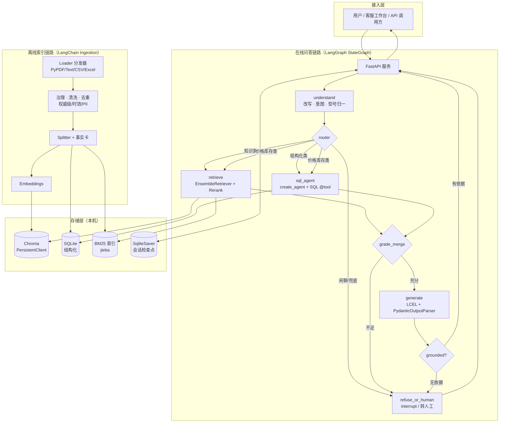
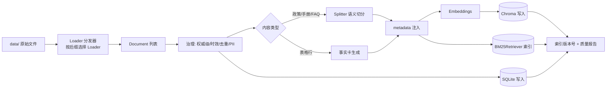
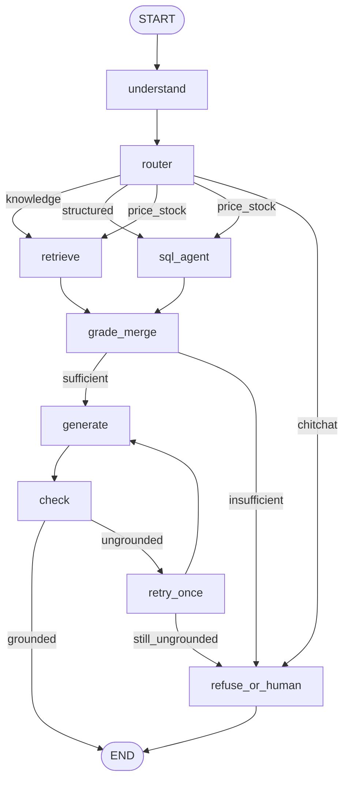
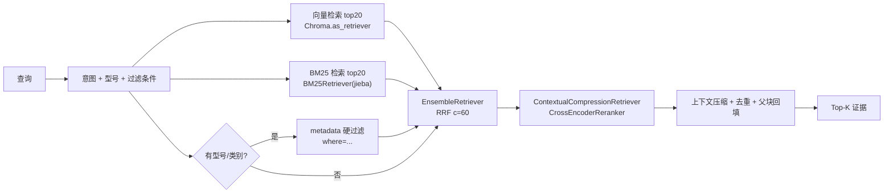
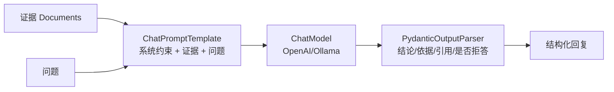
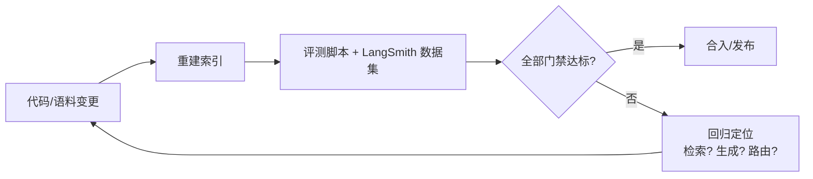
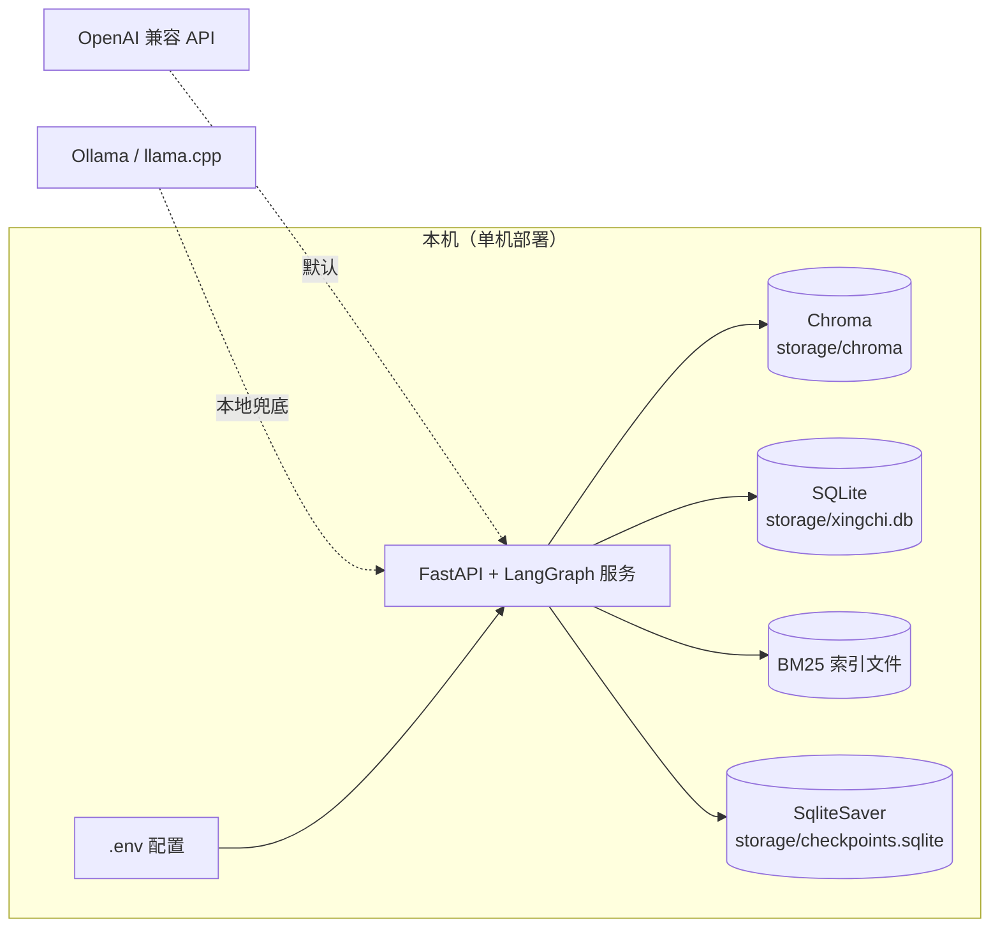

# 星驰科技 RAG 智能客服 · 系统开发文档

| 项目 | 内容 |
|---|---|
| 项目名称 | 星驰科技 RAG 智能客服（Xingchi RAG Customer Service） |
| 文档版本 | v3.0（实现规格补全） |
| 状态 | 设计冻结（可进入开发） |
| 业务主体 | 星驰科技（深圳）有限公司 |
| 核心目标 | 检索召回率高、回答准确率高、最终回复清晰明确 |
| 开发框架 | **LangChain + LangGraph**（开发主线） |
| 模型与存储 | OpenAI 兼容 API 优先，可切 Ollama / llama.cpp；Chroma 本地持久化 |

> v3.0 变更：补齐实现级契约（工程结构、配置、DDL、API、判据、鉴权、NFR、测试），修正依赖版本与导入路径，新增"实现规格"章节。本版可作为开发依据。

---

## 目录

1. [项目概述](#1-项目概述)
2. [数据资产与治理](#2-数据资产与治理)
3. [开发技术栈选型](#3-开发技术栈选型)
4. [系统总体架构](#4-系统总体架构)
5. [数据接入与索引（离线）](#5-数据接入与索引离线)
6. [查询理解与路由](#6-查询理解与路由)
7. [检索与召回](#7-检索与召回)
8. [生成与回复](#8-生成与回复)
9. [评测体系](#9-评测体系)
10. [部署与运维](#10-部署与运维)
11. [里程碑与风险](#11-里程碑与风险)
12. [实现规格（开发契约）](#12-实现规格开发契约)
13. [附录](#13-附录)

---

## 1. 项目概述

### 1.1 背景

星驰科技面向家庭入户与公寓租赁场景销售智能门锁、智能摄像头、智能门铃、智能网关与门窗传感器等产品。当前售前售后知识分散在 PDF 手册、文本政策、FAQ、CSV/TSV/XLSX 表格等多种载体中，人工客服检索效率低、口径不一致，易出现型号串号、价格/库存过期等问题。

本项目构建一套 **RAG（Retrieval-Augmented Generation）智能客服**，以现有 `data/` 目录资料为唯一知识底座，实现"问得准、答得对、说得清"。

### 1.2 核心目标与成功指标

| 目标维度 | 说明 | 量化指标（门禁） |
|---|---|---|
| 检索召回率高 | 正确知识片段必须能被召回 | Recall@5 ≥ 0.90，MRR ≥ 0.80 |
| 回答准确率高 | 回答忠实于知识库、无幻觉 | Faithfulness ≥ 0.85，Correctness ≥ 0.85 |
| 最终回复清晰明确 | 结论先行、结构清晰、带来源、边界清楚 | 人工清晰度评分 ≥ 4.2/5，引用准确率 ≥ 0.90 |
| 拒答可靠 | 知识库无答案时不编造 | 拒答/转人工准确率 ≥ 0.95 |

### 1.3 范围

- **范围内**：多格式知识接入与治理、混合检索、意图路由、结构化查询、答案生成与引用、评测体系、本地化部署。
- **非目标（本版本不做）**：真实订单/CRM 系统对接、多语言、语音交互、主动营销、模型训练/微调。

---

## 2. 数据资产与治理

### 2.1 资产盘点

`data/` 下共 **15 个文件、5 种格式**，均围绕星驰科技产品与售后服务。

| 目录 | 文件 | 内容 | 归类 | 处理去向 |
|---|---|---|---|---|
| pdf | 2026产品目录.pdf | 在售产品目录、价格明细 | 半结构化 | 向量库（文本 + 表格事实卡） |
| pdf | 产品使用手册_星驰智能门锁.pdf | 安装步骤、技术参数 | 非结构化 | 向量库 |
| pdf | 售后服务指南.pdf | 服务时效、保修条款、联系方式 | 非结构化 | 向量库 |
| txt | 客服FAQ_售前售后.txt | 售前/安装/报修/退换 FAQ | 非结构化 | 向量库（Q&A 原子块） |
| txt | 保修政策与退换货说明.txt | 保修/退换条款、时效 | 非结构化 | 向量库（条款切分） |
| txt | 产品介绍_星驰智能门锁.txt | 产品定位、型号对比、技术亮点 | 非结构化 | 向量库 |
| csv | 产品参数表.csv | 产品规格参数 | 结构化 | SQLite + 事实卡 |
| csv | 售后工单记录.csv | 工单明细 | 结构化 | SQLite |
| csv | 客户信息表.csv | 客户档案（含 PII） | 结构化 | SQLite（脱敏，**不入向量库**） |
| tsv | 产品参数表.tsv | 与 csv 版重复 | 结构化 | **去重**，忽略 |
| tsv | 常见问题分类.tsv | 工单分类、责任部门、首响时限 | 结构化 | SQLite + 事实卡 |
| tsv | 库存清单.tsv | 仓库库存、安全库存 | 结构化 | SQLite + 事实卡 |
| xlsx | 产品价格与库存.xlsx | 出厂价/零售价/毛利率、库存分布 | 结构化 | SQLite + 事实卡 |
| xlsx | 产品销售数据.xlsx | 月度/区域/产品汇总销量 | 结构化 | SQLite |
| xlsx | 售后工单统计.xlsx | 工单明细（损坏）、状态汇总 | 结构化 | **降级为参考**，以 csv 为准 |

### 2.2 数据质量问题（已核实）

> 以下问题是本 RAG 系统必须显式处理的真实缺陷，直接决定"准确率"。

1. **库存冲突**：`产品参数表`（csv/tsv）的库存列与 `库存清单.tsv`、`产品价格与库存.xlsx` 不一致。
   - 例：XC-L100 在参数表为 `320`，在库存清单/xlsx 为 `180`；XC-L200 为 `158` vs `96`。
2. **重复数据**：`产品参数表.csv` 与 `产品参数表.tsv` 内容完全一致。
3. **损坏数据**：`售后工单统计.xlsx` 的「工单明细」sheet 全部退化为表头行，无有效数据。
4. **统计冲突**：`售后工单统计.xlsx`「状态汇总」与 `售后工单记录.csv` 口径不一致。
   - csv 实际：已解决 4 / 处理中 1 / 待客户反馈 1（共 6）；
   - xlsx 汇总：已解决 3 / 处理中 1 / 待客户反馈 1 / 已关闭 1（共 6）。
5. **PII 风险**：`客户信息表.csv` 含客户姓名、城市、脱敏手机号。
6. **时效缺失**：多数文档无明确更新时间，仅 `库存分布` 标注 `2026-03-31`。

### 2.3 治理规则

#### 2.3.1 权威级别与时效（Source of Truth）

`authority_rank` 枚举（数值越小越权威，冲突时优先取值）：

| `authority_rank` | 来源 | 覆盖数据域 |
|---|---|---|
| 10 | `库存清单.tsv`、`产品价格与库存.xlsx` | 库存、价格 |
| 20 | `产品参数表.csv` | 产品参数、解锁方式 |
| 20 | `保修政策与退换货说明.txt`、`售后服务指南.pdf` | 保修/退换政策 |
| 30 | `2026产品目录.pdf`、`产品介绍_星驰智能门锁.txt`、`客服FAQ_售前售后.txt` | 叙述性文本 |
| 40 | `产品参数表.tsv`（重复源） | 忽略，仅留痕 |
| 90 | `售后工单统计.xlsx/状态汇总`（可疑） | 参考，不参与回答 |

| 数据域 | 权威来源 | 备注 |
|---|---|---|
| 库存 | `库存清单.tsv` = `产品价格与库存.xlsx/库存分布` | `产品参数表` 库存列降级、不参与回答 |
| 价格（零售/出厂/毛利率） | `产品价格与库存.xlsx` = `2026产品目录.pdf` | 零售价一致 |
| 产品参数/解锁方式 | `产品参数表.csv` | 与产品介绍交叉校验 |
| 保修/退换政策 | `保修政策与退换货说明.txt` = `售后服务指南.pdf` | 以条款为准 |
| 工单 | `售后工单记录.csv` | xlsx 工单明细损坏，不采用 |
| 工单统计 | 由 `售后工单记录.csv` **实时聚合** | 不信任 xlsx 状态汇总 |

**冲突消解策略**：
1. 结构化字段冲突 → 按上表权威来源取值，并在回答中标注数据更新时间；
2. 文本与表格冲突 → 表格（结构化）优先于叙述性文本；
3. 无法消解 → 触发兜底话术并提示以人工/发票为准。

#### 2.3.2 去重

- 以「文件名 + 内容 SHA-256」为幂等键；`产品参数表.csv/.tsv` 内容相同，只保留一个逻辑 `doc_id`。
- 事实卡生成后按 `(product_model, 字段)` 去重，保留权威值。

#### 2.3.3 PII 与合规

- `客户信息表` **不进入向量库 / 不进入检索索引**；SQLite 中手机号以加盐 SHA-256 存储，另存尾 4 位用于核对。
- 结构化查询返回客户信息时需鉴权，回答中默认不回显手机号/姓名，除非通过身份校验（见 §12.7）。
- 日志脱敏后再记录，禁止落原文明文。

#### 2.3.4 数据质量校验（入库前门禁）

- 行数/列数校验：检测退化为表头的 sheet（如工单明细）并告警跳过。
- 枚举校验：`上市状态 ∈ {已上市, 预售}`、`状态 ∈ {已解决, 处理中, 待客户反馈, 已关闭}`。
- 交叉一致性校验：同字段跨来源比对，差异写入 `storage/data_quality_report.json`。

---

## 3. 开发技术栈选型

### 3.1 为什么使用框架而非原生 SDK

项目选择 **LangChain + LangGraph** 作为开发主线，而非直接调用模型原生 SDK，原因：

1. **组件开箱即用**：文档加载、分块、向量库封装、BM25、混合检索（RRF）、重排、输出解析均为框架标准组件，避免重复造轮子。
2. **编排与状态管理**：多轮会话、路由、重试、降级、转人工需要状态机；LangGraph 以图原语（节点/条件边/检查点）表达，比手写 `if/else` 更可维护、可观测。
3. **多 Provider 统一抽象**：`langchain-openai` / `langchain-ollama` / `langchain-chroma` 统一接口，切换模型与向量库零改动，满足"API 优先、可切本地"。
4. **可观测与评测闭环**：LangSmith 追踪 + RAGAS 指标 + 自建检索指标，构成完整评测闭环（注：LangChain 1.x 核心已精简掉传统 evaluator，评测以 LangSmith/RAGAS 为主）。
5. **生态与长期维护**：社区集成覆盖本项目数据格式与模型，降低长期维护成本。

> 代价与应对：框架存在版本迭代与抽象泄漏风险。应对见 §3.4（锁版本 + 薄封装 + 评测门禁）。

### 3.2 选型总览（版本已按 PyPI 实际发布校正）

| 层次 | 选型 | 关键版本 | 选择原因 | 备选与放弃原因 |
|---|---|---|---|---|
| 编排框架 | **LangGraph** | ≥1.2,<2.0 | 图化状态机、条件路由、检查点持久化、中断/转人工 | 手写状态机（不可观测）；纯 LCEL（分支/循环表达弱） |
| 核心框架 | **LangChain** | ≥1.4,<2.0 | Agent（`create_agent`）、LCEL、Prompt、输出解析 | 原生 SDK（散、无编排） |
| 经典组件 | **langchain-classic** | ≥1.0,<2.0 | `EnsembleRetriever`/`ContextualCompressionRetriever`/`CrossEncoderReranker` | 自实现（重复劳动） |
| 集成层 | **langchain-community** | ≥0.4,<0.5 | `BM25Retriever`、`HuggingFaceCrossEncoder`、`SQLDatabase` | 逐个自写 |
| 模型接入 | **langchain-openai / langchain-ollama** | ≥1.6 / ≥1.1 | 一套接口切官 API / Ollama；`with_fallbacks` 降级 | 原生 `openai` SDK（无链式降级） |
| 向量库 | **langchain-chroma + Chroma** | ≥1.1 / chromadb ≥1.5.5 | 单机零运维、`PersistentClient` 本地磁盘、metadata 过滤 | Milvus/Qdrant（需服务）；FAISS（无元数据管理） |
| 稀疏检索 | **BM25 + jieba** | rank-bm25 0.2.2 / jieba | 补足稠密检索对型号/数字/专有名词的弱点 | 纯向量（型号数字易错、串号） |
| 融合 | **EnsembleRetriever（RRF）** | langchain-classic | 内置 RRF，无需调权重、鲁棒 | 手写加权求和（需调参） |
| 重排 | **CrossEncoderReranker + bge-reranker-v2-m3**（sentence-transformers） | langchain-classic | 交叉编码器精排，提升 top-k 精度 | 不重排（噪声拉低准确率） |
| 结构化底座 | **SQLite（stdlib）** | 3.x | 零依赖、本机文件、数据量小 | DuckDB（可选）；MySQL/PG（重） |
| Text2SQL | **SQL Agent（`create_agent` + @tool）** | langchain ≥1.4 | 内置 schema/查询/校验工具范式 | 手写规则（覆盖不全） |
| Web 框架 | **FastAPI** | ≥0.115 | 异步、Pydantic 校验、流式输出 | Flask（同步）；Django（重） |
| 鉴权 | **PyJWT** | ≥2.8 | 轻量签发/校验客户令牌 | Session（需服务端存储） |
| 配置/日志 | **pydantic-settings / loguru** | —— | 类型安全、结构化日志、脱敏方便 | 裸环境变量（易错） |
| 评测 | **LangSmith + RAGAS + pytest** | langsmith ≥0.12 / ragas 0.4.x | 追踪 + 指标 + 门禁 | 纯人工（不可持续） |

### 3.3 设计要素 → 框架组件映射

| 设计要素 | 采用组件 | 说明 |
|---|---|---|
| 多格式加载 | `PyPDFLoader` / `TextLoader` / `CSVLoader` / **自研 `ExcelDocumentLoader(BaseLoader)`** / 自研按后缀分发器 | 统一产出 `Document`（XLSX 用 openpyxl，避免额外 `unstructured` 依赖） |
| 分块 | `RecursiveCharacterTextSplitter` / `MarkdownHeaderTextSplitter` | 按类型配置分隔符 |
| 元数据 | `Document.metadata` | 见 §5.4 |
| 向量库 | `Chroma`（langchain-chroma）+ `chromadb.PersistentClient` | 本地持久化 |
| Embedding | `OpenAIEmbeddings`（默认）/ `OllamaEmbeddings`（兜底） | 由 `EMBED_PROVIDER` 切换 |
| 混合检索 | `EnsembleRetriever(retrievers=[...], weights=..., c=60)` | 内置 RRF |
| 重排 | `ContextualCompressionRetriever(base_compressor=CrossEncoderReranker(...))` | 精排 + 压缩 |
| 查询改写 | `create_history_aware_retriever`（`langchain_classic.chains`） | 多轮指代消解 |
| 结构化问答 | `create_agent` + SQL `@tool`（list_tables/schema/query/query_checker） | Text2SQL |
| 路由 | LangGraph `add_conditional_edges`（含并行 fan-out） | 意图分流，见 §12.6 |
| 生成 | LCEL `prompt | model | parser` + `PydanticOutputParser` | 结构化清晰回复 |
| 判据 | 自研 `grade` / `check` 节点 | 见 §12.5 |
| 降级 | `.with_fallbacks([...])` | API → Ollama → llama.cpp |
| 会话记忆 | LangGraph `SqliteSaver` + `thread_id` | 多轮 + 持久化 |
| 转人工 | LangGraph `interrupt()` / `Command` | 人在环 |
| 评测 | LangSmith 数据集 + RAGAS + 自建检索指标 | 门禁回归 |

### 3.4 版本与兼容性策略

- 锁定兼容区间（见 `requirements.txt`），CI 使用锁文件（`uv.lock`/`pip-tools`）保证可复现。
- 对框架调用做**薄封装**（`llm_factory`、`embeddings_factory`、`retriever_factory`），关键链路不散落框架 API。
- 每次框架升级必须回归评测门禁（§9.4），未达标不得合并。

---

## 4. 系统总体架构

### 4.1 端到端架构



### 4.2 离线索引流水线



### 4.3 在线问答状态图（LangGraph）



> 说明：`price_stock` 通过 fan-out 并行进入 `retrieve` 与 `sql_agent`，在 `grade_merge` 汇合（详见 §12.6）。`retrieve` 内部为 `EnsembleRetriever`（向量 + BM25，RRF）→ `ContextualCompressionRetriever`（`CrossEncoderReranker`）→ 去重/压缩。`grade_merge` 为证据充分性判据（§12.5）。`check` 为引用/数值依据校验（§12.5）。

---

## 5. 数据接入与索引（离线）

### 5.1 加载器分工

| 格式 | 组件 | 要点 |
|---|---|---|
| PDF | `PyPDFLoader`（`langchain_community`） | 逐页 `Document`，`metadata` 带 `page` |
| TXT | `TextLoader(encoding="utf-8")` | 明确编码 |
| CSV/TSV | `CSVLoader(separator="," / "\t", source_column=...)` | 溯源到文件名 |
| XLSX | **自研 `ExcelDocumentLoader(BaseLoader)`**（openpyxl） | 逐 sheet；跳过退化 sheet 并告警；保留 sheet 名 |
| 目录批处理 | **自研 `dispatch_loader(path)`** | 按后缀选择 Loader（`DirectoryLoader` 只支持单一 `loader_cls`，无法自动分发多格式） |

### 5.2 分块策略

| 内容类型 | 切分单位 | 组件与分隔符 |
|---|---|---|
| 政策条款 | **每条一 chunk** | `RecursiveCharacterTextSplitter(separators=["第","条","\n\n"])`，保留条名 |
| FAQ | **一问一答一 chunk** | 正则预切分，`text = 问题 + 答案` |
| 使用手册 | **按小节/步骤组** | `MarkdownHeaderTextSplitter` 或按「第X步」分组 |
| 产品介绍 | 按型号段落 | `RecursiveCharacterTextSplitter` |
| 表格行 | **事实卡** | 行 → 自然语言事实句（见 §5.3） |

**通用参数**：目标 chunk 256~512 tokens，重叠 10%~15%。超长条款再分时保留 `parent_id` 指向父块；离线同时构建 **parent docstore**（`storage/parent_store/`，键为 `parent_id`），检索命中子块时按 `parent_id` 回填父块（等价于 `ParentDocumentRetriever` 的"小块检索、大块补全"，本项目自建以控制权威级与 PII）。

### 5.3 表格 → 事实卡（结构化语义化）

**示例（产品参数）**：

```
产品：星驰智能门锁 Pro（型号 XC-L100）；类别：智能门锁；
解锁方式：指纹/密码/APP/机械钥匙；面板材质：铝合金；建议零售价：1999 元；
上市状态：已上市；保修期：3 年；库存：深圳中心仓 180 台。
```

**示例（库存告警）**：

```
库存预警：XC-L200（星驰智能门锁 Max）上海分仓在库 96 台，
低于安全库存 120 台，补货状态为「需补货」，数据更新时间 2026-03-31。
```

### 5.4 Chunk 元数据 Schema（`Document.metadata`）

| 字段 | 类型 | 必填 | 说明 |
|---|---|---|---|
| `chunk_id` | str | 是 | 全局唯一（`doc_id` + 序号） |
| `doc_id` | str | 是 | 逻辑文档（去重后） |
| `parent_id` | str \| null | 否 | 父块 ID（超长条款再分时） |
| `source_file` | str | 是 | 原始文件名 |
| `doc_type` | enum | 是 | policy / manual / faq / catalog / inventory / sales / ticket |
| `product_model` | str | 否 | 归一化型号（如 `XC-L100`） |
| `product_category` | str | 否 | 智能门锁 / 摄像头 / … |
| `section` | str | 否 | 条款号 / 小节名 |
| `authority_rank` | int | 是 | 权威级别，见 §2.3.1 |
| `effective_date` | date | 否 | 生效/更新时间（缺省取入库时间） |
| `pii_flag` | bool | 是 | 是否含 PII（PII 块不入向量库） |

### 5.5 索引构建与版本化

- Embeddings 批量计算（batch=64，`tenacity` 重试）。
- Chroma collection：`xingchi_kb_v{N}`；`metadata` 支持 `where` 过滤。
- BM25 与 SQLite 随版本同步重建；产出 `storage/manifest.json`（语料哈希、模型版本、chunk 数、时间戳），支持原子切换与回滚。
- **重建触发**：语料变更、embedding 模型变更、切分策略变更；重建后必须通过评测门禁（§9.4）。

---

## 6. 查询理解与路由

### 6.1 意图分类

| 意图 | 触发示例 | LangGraph 路由目标 |
|---|---|---|
| `product_spec` | 「L100 支持哪些解锁方式」 | `retrieve` |
| `price_stock` | 「L200 多少钱/还有货吗」 | `retrieve` ∥ `sql_agent`（fan-out） |
| `policy_warranty` | 「门锁保修几年」 | `retrieve` |
| `ticket_order` | 「我的工单处理到哪了」 | `sql_agent`（需鉴权） |
| `install_debug` | 「配网失败怎么办」 | `retrieve` |
| `faq_general` | 「怎么退货」 | `retrieve` |
| `chitchat` | 「你好」 | 轻量回复 / 引导 |
| `unknown` | 超纲 | `refuse_or_human` |

实现：规则（关键词/正则，快）+ 结构化输出 LLM 分类（`PydanticOutputParser`，准）双通道，规则命中优先。

### 6.2 型号归一化与消歧（关键）

- 型号别名表：`XC-L100`、`L100`、`门锁Pro`、`智能门锁 Pro` → `XC-L100`；同理 L200 / L50 / C50 / C80 / D10 / H30 / S1。
- **消歧**：用户仅说"门锁多少钱"时，不臆测型号，返回型号列举或追问；仅当上下文/实体明确时才对 `Chroma` 加 `where={"product_model": ...}` 硬过滤，避免串号。
- 校验：型号不存在（如 `XC-L300`）→ 明确告知无此型号，杜绝编造。

### 6.3 Text2SQL（LangChain SQL Agent）

- `SQLDatabase` 连接 SQLite，`@tool` 定义四件套：`sql_db_list_tables` / `sql_db_schema` / `sql_db_query` / `sql_db_query_checker`。
- `create_agent(model, tools, system_prompt)` 组装查询 Agent；系统提示限定 dialect、`top_k`、先查 schema 再执行。
- **安全**：连接串只读、`sqlglot` 二次校验仅允许 `SELECT`、强制 `LIMIT`、超时保护（见 §12.9）。
- 结果格式化为自然语言表格，作为证据注入 `grade_merge`。

### 6.4 多轮会话改写

- 使用 `create_history_aware_retriever`（`langchain_classic.chains`）或自定义 Prompt 链，将历史对话 + 当前问题改写为自包含查询（如"它保修多久"→"XC-L200 保修多久"）。
- 会话状态由 LangGraph `SqliteSaver` 检查点按 `thread_id` 持久化；超长时用摘要节点压缩。

---

## 7. 检索与召回

> 本章直接对应"检索召回率高"。

### 7.1 混合检索流程



### 7.2 各环节设计（对应组件）

1. **向量检索**：`vector_store.as_retriever(search_type="similarity", search_kwargs={"k":20, "filter": {...}})`。
2. **稀疏检索**：`BM25Retriever.from_documents(docs, preprocess_func=jieba_tokenize, k=20)`。
3. **元数据硬过滤**：型号/类别明确时通过 `filter`/`where` 先过滤，降低串号。
4. **融合**：`EnsembleRetriever(retrievers=[bm25, vector], weights=[0.5,0.5], c=60)`。
5. **重排**：`ContextualCompressionRetriever(base_retriever=ensemble, base_compressor=CrossEncoderReranker(model=HuggingFaceCrossEncoder("BAAI/bge-reranker-v2-m3"), top_n=5))`。
6. **压缩与去重**：`EmbeddingsFilter`/`LLMChainFilter` 过滤无关段；按 `chunk_id` 去重；子块命中时按 `parent_id` 回填父块。
7. **证据装配**：`Document.metadata` 随证据入 `grade_merge`，供判据与引用。

### 7.3 参数与调优

| 参数 | 初值 | 调优方向 |
|---|---|---|
| 向量 `k` | 20 | 召回不足则增大 |
| BM25 `k` | 20 | 型号/数字类加大 |
| Ensemble `c` | 60 | 30~100 试验 |
| weights | [0.5, 0.5] | 型号类问题调高 BM25 权重 |
| Reranker `top_n` | 5 | 观察 Faithfulness 与上下文长度 |

---

## 8. 生成与回复

> 本章对应"准确率高 + 回复清晰明确"。

### 8.1 生成链（LCEL）



### 8.2 Prompt 设计原则

1. **只依据给定证据**，不得使用外部知识；
2. **强制引用来源**：`[来源: 文件名 · 章节]`；
3. **证据不足必须拒答**，给出转人工入口，不得编造；
4. **结论先行 + 分点叙述**，数字/型号加粗；
5. **声明边界**（价格以各渠道公示为准、保修以发票为准）。

Prompt 模板版本化存放于 `configs/prompts/`（如 `generate.v1.md`），回答记录中保存 `prompt_version` 以便追溯（见 §12.2、§12.4）。

### 8.3 回复结构模板

```
【结论】<一句话直接回答>
【依据】
 1. <要点>（[来源: 产品介绍_星驰智能门锁.txt · 二、核心型号对比]）
 2. <要点>（[来源: 保修政策与退换货说明.txt · 第一条]）
【补充】<注意事项/边界>
【如需人工】客服热线 400-820-6688
```

### 8.4 拒答与转人工

触发：证据不足 / 超纲 / 敏感 PII 未鉴权 / 型号不存在 / 政策冲突无法消解。

```
抱歉，当前知识库中没有找到支持该问题的明确依据，为避免提供不准确的信息，
建议您联系人工客服进一步确认。
客服热线：400-820-6688；服务邮箱：service@xingchi-tech.example
```

在 LangGraph 中，`refuse_or_human` 节点可调用 `interrupt()` 暂停图，等待人工介入后以 `Command(resume=...)` 恢复（转人工开关见 §12.2 `HUMAN_HANDOFF_ENABLED`）。

### 8.5 消歧回复

```
星驰智能门锁目前在售/预售的型号有：
· XC-L50（Lite）1299 元 · 指纹/密码 · 预售
· XC-L100（Pro）1999 元 · 指纹/密码/APP/机械钥匙
· XC-L200（Max）3299 元 · 增加 3D 人脸识别
请问您想了解哪一款？
```

### 8.6 安全与合规

- **Prompt 注入防护**：系统指令与用户输入分离，拒绝"忽略以上指令"类请求。
- **PII 防护**：输出层过滤手机号/完整姓名；工单查询需鉴权（§12.7）。
- **幻觉控制**：`grade_merge` 判据不足强制拒答；`check` 校验引用与数值（§12.5）。
- **一致性**：价格/库存等时效敏感信息附更新时间。

---

## 9. 评测体系

### 9.1 金标问答集（Golden Set）

从 15 个文件人工构建，格式为 JSONL，schema 见 §12.10。规模建议 **80~120 条**，含 15%~20% 无答案/拒答类；按 **dev / holdout** 划分（7:3），holdout 仅用于阶段验收。

| 编号 | 问题 | 类型 | 期望答案要点 | 金标来源 |
|---|---|---|---|---|
| G001 | XC-L100 和 XC-L200 有什么区别？ | 对比 | L200 增 3D 人脸、锌合金、贵 1300、均 3 年保 | FAQ A1 / 产品介绍 |
| G002 | XC-L50 什么时候发货？ | 售前 | 2026 年第二季度陆续发货 | FAQ A2 / 产品目录 |
| G003 | 智能门锁保修几年？ | 政策 | 整机 3 年，自签收次日起算 | 保修政策 第一条 |
| G004 | 7 天无理由退货适用定制开孔吗？ | 政策 | 不适用 | 退换货 第四条 |
| G005 | XC-L100 现在库存多少？ | 结构化 | 深圳中心仓 180 台（以库存清单为准） | 库存清单 / xlsx |
| G006 | 哪些仓库需要补货？ | 结构化 | XC-L200 上海分仓需补货；XC-L50 缺货 | 库存清单 |
| G007 | 指纹冬天识别不了怎么办？ | 故障 | 半导体电容式可识别；失败可用密码/APP | FAQ Q3/Q7 |
| G008 | 门锁连不上 WiFi 怎么办？ | 安装 | 需 2.4GHz；长按重置键 3 秒重配 | FAQ A5 |
| G009 | XC-L200 的出厂价和毛利率？ | 结构化 | 出厂 1980 元，毛利率 40.0% | 价格与库存.xlsx |
| G010 | 你们支持以旧换新吗？ | 无答案 | 知识库无依据 → 拒答转人工 | — |
| G011 | XC-L300 卖多少钱？ | 无答案 | 无此型号 → 明确说明 | 产品参数表 |
| G012 | 帮我查一下张伟的工单 | PII/权限 | 未鉴权 → 引导身份校验 | 工单记录（受限） |

### 9.2 指标定义

**检索层**

| 指标 | 定义 | 目标 |
|---|---|---|
| Recall@k | Top-k 中命中金标 chunk 的比例 | ≥0.90 @5 |
| Precision@k | Top-k 中相关比例 | ≥0.60 @5 |
| MRR | 首个相关结果排名倒数均值 | ≥0.80 |
| nDCG@k | 排序质量 | 持续提升 |
| Hit Rate | 至少命中一个金标的问题占比 | ≥0.95 |

**生成层**

| 指标 | 定义 | 目标 |
|---|---|---|
| Faithfulness | 回答是否全部有证据支撑 | ≥0.85 |
| Answer Relevance | 回答与问题相关度 | ≥0.85 |
| Correctness | 与期望答案一致度 | ≥0.85 |
| Citation Accuracy | 引用是否指向真实来源 | ≥0.90 |
| Refusal Accuracy | 无答案题正确拒答率 | ≥0.95 |

**路由层**：意图分类准确率 ≥ 0.90。

### 9.3 评测方法（框架化）

- **追踪**：LangSmith 全链路 trace（检索、重排、生成、耗时、token）。
- **检索指标**：基于 `retriever.invoke` 输出与金标 `chunk_id`/`doc_id` 比对，计算 Recall@k / Precision@k / MRR / nDCG。
- **生成指标**：RAGAS 0.4.x（`faithfulness`、`answer_relevancy`、`context_precision`、`context_recall`、`answer_correctness`）接入 LangChain 模型与检索结果；Citation Accuracy 由 §12.5 的引用校验器统计。
- **人工**：每周抽检 20 条，评清晰度/准确性/语气，回流金标集。
- **难度分层**：对比题、数字/型号题、聚合题、多跳题、拒答题分桶统计。

### 9.4 回归门禁

`pytest` + 评测脚本（`scripts/run_eval.py`）跑 dev 集，任一指标低于门禁即 CI 失败；holdout 仅阶段验收。



---

## 10. 部署与运维

### 10.1 本地部署拓扑



- Chroma 使用 `chromadb.PersistentClient(path="storage/chroma")`，**本机磁盘持久化，不做局域网服务化**。

### 10.2 模型接入与降级（LangChain）

```python
from langchain_openai import ChatOpenAI
from langchain_ollama import ChatOllama

primary = ChatOpenAI(model=settings.llm_model, base_url=settings.openai_base_url, api_key=settings.openai_api_key)
fallback = ChatOllama(model=settings.ollama_model, base_url=settings.ollama_base_url)
model = primary.with_fallbacks([fallback], exceptions_to_handle=(Exception,))
```

`.env` 关键项（完整契约见 §12.2）：

```dotenv
LLM_PROVIDER=openai
OPENAI_BASE_URL=https://api.openai.com/v1
OPENAI_API_KEY=sk-***
LLM_MODEL=gpt-4o-mini
LLM_FALLBACK=ollama
OLLAMA_BASE_URL=http://localhost:11434
OLLAMA_MODEL=qwen2.5:7b

EMBED_PROVIDER=openai
EMBED_MODEL=text-embedding-3-small
RERANK_MODEL=BAAI/bge-reranker-v2-m3

CHROMA_PATH=storage/chroma
SQLITE_PATH=storage/xingchi.db
CHECKPOINT_PATH=storage/checkpoints.sqlite

LANGSMITH_TRACING=true
LANGSMITH_PROJECT=xingchi-rag-cs
LANGSMITH_API_KEY=ls-***

AUTH_ENABLED=true
JWT_SECRET=change-me
HUMAN_HANDOFF_ENABLED=true
```

### 10.3 可观测性

- LangSmith 追踪每次请求：路由、检索、重排、生成、引用、token、耗时。
- 指标面板：P50/P95 延迟、召回命中率（抽样）、拒答率、Provider 失败率。
- 告警：Provider 连续失败、索引版本不匹配、数据质量报告异常。

### 10.4 性能与成本

| 手段 | 收益 |
|---|---|
| 意图/型号规则优先 | 减少 LLM 调用 |
| 重排只跑 top20 | 控制成本与延迟 |
| 上下文压缩 | 降低 token 与噪声 |
| 结果缓存（FAQ 高频问） | 降延迟、降成本 |
| 本地兜底（with_fallbacks） | 断网可用、控成本 |

---

## 11. 里程碑与风险

### 11.1 里程碑

| 阶段 | 内容 | 交付/验收 |
|---|---|---|
| P0 数据治理 | Loader 接入、去重、权威级、PII、质量报告 | 质量报告通过、事实卡生成 |
| P1 基础索引与检索 | Chroma+BM25、元数据、Splitter | 单路检索可召回金标 chunk |
| P2 混合检索与重排 | EnsembleRetriever + CrossEncoderReranker | 检索 Recall@5 ≥ 0.80 |
| P3 路由与生成 | LangGraph 图、SQL Agent、Prompt、判据、拒答 | 端到端可用，清晰度达标 |
| P4 评测闭环 | LangSmith + RAGAS + 门禁 | 全部门禁达标 |
| P5 加固 | 安全、观测、降级、中断转人工 | 压测与故障演练通过 |

### 11.2 风险与缓解

| 风险 | 影响 | 缓解 |
|---|---|---|
| 数据冲突/过期 | 回答错误 | 权威级 + 时效标注 + 兜底话术 |
| 型号串号 | 准确性下降 | 型号归一 + 硬过滤 + 消歧 |
| 表格被当作文本问答 | 数值错误 | 双通道：SQL Agent 精确查询 |
| 语料过小覆盖不足 | 拒答偏多 | 明确引导转人工，持续补料 |
| 幻觉 | 信任受损 | 强制引用 + 判据拒答 + 评测门禁 |
| PII 泄露 | 合规风险 | 不入向量库 + 哈希 + 鉴权 + 输出过滤 |
| 框架升级破坏兼容 | 交付风险 | 锁版本区间 + 薄封装 + 升级必过评测门禁 |

---

## 12. 实现规格（开发契约）

> 本章为 v3.0 新增，是开发与验收的直接依据。所有阈值/默认值标记为「初值」，上线前由评测调优。

### 12.1 工程结构

```
rag_project/
├─ data/                          # 原始资料（只读，禁止改动）
├─ storage/                       # 运行时产物（.gitignore）
│  ├─ chroma/                     # Chroma 持久化
│  ├─ xingchi.db                  # SQLite 结构化库
│  ├─ bm25/                       # BM25 索引
│  ├─ parent_store/               # 父块 docstore
│  ├─ checkpoints.sqlite          # LangGraph 会话检查点
│  ├─ manifest.json               # 索引版本清单
│  └─ data_quality_report.json
├─ configs/
│  ├─ sources.yaml                # 权威级别/时效/去重规则
│  ├─ aliases.yaml                # 型号别名表
│  └─ prompts/                    # 版本化 Prompt 模板
│     ├─ understand.v1.md
│     ├─ grade.v1.md
│     └─ generate.v1.md
├─ src/xingchi_rag/
│  ├─ config.py                   # Settings（pydantic-settings）
│  ├─ logging.py                  # loguru + PII 脱敏
│  ├─ providers/
│  │  ├─ llm.py                   # llm_factory + with_fallbacks
│  │  └─ embeddings.py            # embeddings_factory
│  ├─ ingestion/
│  │  ├─ loaders.py               # ExcelDocumentLoader 等
│  │  ├─ dispatch.py              # 按后缀分发
│  │  ├─ governance.py            # 权威级/去重/PII/质量报告
│  │  ├─ splitters.py
│  │  ├─ factcards.py
│  │  └─ pipeline.py
│  ├─ sql/
│  │  ├─ schema.sql               # DDL（§12.3）
│  │  ├─ load.py
│  │  └─ agent.py                 # create_agent + @tool
│  ├─ retrieval/
│  │  ├─ factory.py               # retriever_factory
│  │  ├─ hybrid.py                # EnsembleRetriever
│  │  └─ rerank.py                # CrossEncoderReranker
│  ├─ graph/
│  │  ├─ state.py                 # GraphState
│  │  ├─ nodes.py                 # understand/retrieve/sql/grade/generate/check/refuse
│  │  └─ build.py                 # StateGraph 组装（§12.6）
│  ├─ generation/
│  │  ├─ prompts.py
│  │  └─ answer.py                # LCEL + PydanticOutputParser
│  ├─ api/
│  │  ├─ deps.py                  # 鉴权依赖（§12.7）
│  │  ├─ schemas.py               # 请求/响应模型（§12.4）
│  │  └─ routes.py
│  └─ utils/
├─ eval/
│  ├─ golden/golden_set.jsonl
│  ├─ golden/schema.json
│  ├─ metrics.py
│  └─ run.py
├─ tests/{unit,integration}/
├─ scripts/{build_index.py,run_eval.py,serve.py}
├─ docs/RAG系统开发文档.md
├─ requirements.txt
└─ .env.example
```

### 12.2 配置契约（Settings）

`src/xingchi_rag/config.py` 用 `pydantic-settings` 定义，字段与 `.env` 一一对应：

| 变量 | 类型 | 默认 | 说明 |
|---|---|---|---|
| `LLM_PROVIDER` | enum | `openai` | openai / ollama / llamacpp |
| `OPENAI_BASE_URL` / `OPENAI_API_KEY` / `LLM_MODEL` | str | — | 主模型 |
| `LLM_FALLBACK` | enum | `ollama` | 降级目标 |
| `OLLAMA_BASE_URL` / `OLLAMA_MODEL` | str | localhost / qwen2.5:7b | 本地兜底 |
| `EMBED_PROVIDER` | enum | `openai` | openai / ollama |
| `EMBED_MODEL` | str | text-embedding-3-small | 向量模型 |
| `RERANK_MODEL` | str | BAAI/bge-reranker-v2-m3 | 重排模型 |
| `RETRIEVE_K` / `BM25_K` / `RERANK_TOP_N` / `RRF_C` | int | 20 / 20 / 5 / 60 | 检索参数 |
| `GRADE_SCORE_THRESHOLD` | float | 0.50 | 充分性阈值（§12.5） |
| `CHECK_RETRY_MAX` | int | 1 | 依据校验失败重试次数 |
| `CHROMA_PATH` / `SQLITE_PATH` / `CHECKPOINT_PATH` | str | storage/* | 存储路径 |
| `LANGSMITH_TRACING` / `LANGSMITH_PROJECT` / `LANGSMITH_API_KEY` | — | — | 追踪 |
| `AUTH_ENABLED` / `JWT_SECRET` / `JWT_TTL_MINUTES` | — | true / change-me / 60 | 鉴权（§12.7） |
| `HUMAN_HANDOFF_ENABLED` | bool | true | 是否允许中断转人工 |
| `REQUEST_TIMEOUT_S` | int | 30 | 单请求超时 |

### 12.3 数据层 DDL（SQLite）

`src/xingchi_rag/sql/schema.sql`（节选）：

```sql
PRAGMA journal_mode=WAL;

CREATE TABLE IF NOT EXISTS product (
  model          TEXT PRIMARY KEY,
  name           TEXT NOT NULL,
  category       TEXT NOT NULL,
  unlock_methods TEXT,
  material       TEXT,
  sale_status    TEXT NOT NULL CHECK (sale_status IN ('已上市','预售')),
  warranty_years INTEGER
);

CREATE TABLE IF NOT EXISTS price (
  model         TEXT PRIMARY KEY REFERENCES product(model),
  factory_price INTEGER,
  retail_price  INTEGER,
  gross_margin  TEXT,
  effective_date TEXT
);

CREATE TABLE IF NOT EXISTS inventory (
  sku            TEXT NOT NULL,
  warehouse      TEXT NOT NULL,
  qty            INTEGER NOT NULL,
  safety_qty     INTEGER NOT NULL,
  restock_status TEXT,
  updated_at     TEXT,
  PRIMARY KEY (sku, warehouse)
);

CREATE TABLE IF NOT EXISTS ticket (
  ticket_no    TEXT PRIMARY KEY,
  customer_id  TEXT NOT NULL,
  product_model TEXT,
  issue_type   TEXT,
  status       TEXT NOT NULL CHECK (status IN ('已解决','处理中','待客户反馈','已关闭')),
  created_date TEXT,
  handle_hours REAL
);

CREATE TABLE IF NOT EXISTS customer (
  customer_id   TEXT PRIMARY KEY,
  name_masked   TEXT,            -- 如 张*
  city          TEXT,
  phone_hash    TEXT,            -- 加盐 SHA-256
  phone_tail    TEXT,            -- 尾 4 位
  register_date TEXT,
  tier          TEXT
);

CREATE TABLE IF NOT EXISTS faq_category (
  code                 TEXT PRIMARY KEY,
  category             TEXT,
  keywords             TEXT,
  dept                 TEXT,
  first_response_hours INTEGER
);

CREATE TABLE IF NOT EXISTS sales_monthly (
  month TEXT, model TEXT, qty INTEGER, amount INTEGER, mom TEXT,
  PRIMARY KEY (month, model)
);
CREATE TABLE IF NOT EXISTS sales_summary (
  model TEXT PRIMARY KEY, year_qty INTEGER, year_amount INTEGER, return_rate TEXT
);

CREATE INDEX IF NOT EXISTS idx_ticket_customer ON ticket(customer_id);
CREATE INDEX IF NOT EXISTS idx_inventory_sku ON inventory(sku);
```

**入库规则**：`products` 库存列不落库（降级）；`inventory` 仅取 `库存清单.tsv` + `xlsx/库存分布`；`ticket` 仅取 csv；`customer` 姓名脱敏、手机号哈希；`售后工单统计.xlsx` 不落库。

### 12.4 API 契约（FastAPI）

统一前缀 `/v1`。鉴权：服务级 `Authorization: Bearer <service_key>`；PII/工单需附加 `X-Customer-Token: <jwt>`（§12.7）。

| 方法 | 路径 | 说明 |
|---|---|---|
| POST | `/v1/chat` | 问答（`stream=false` 一次性返回） |
| POST | `/v1/chat/stream` | 问答（SSE 流式） |
| GET | `/v1/health` | 健康检查（含索引版本、Provider 状态） |
| POST | `/v1/feedback` | 用户反馈（用于回流金标） |

请求/响应模型（Pydantic）：

```python
class ChatRequest(BaseModel):
    message: str
    session_id: str | None = None      # 为空则新建 thread_id
    stream: bool = False
    customer_token: str | None = None  # 查询 PII/工单时必填

class Citation(BaseModel):
    source_file: str
    section: str | None
    chunk_id: str
    score: float | None

class ChatResponse(BaseModel):
    session_id: str
    answer: str
    citations: list[Citation]
    refused: bool
    route: str
    prompt_version: str
    latency_ms: int
    trace_id: str | None
```

SSE 事件：`route` → `token`（增量） → `citations` → `done`。

### 12.5 判据定义（`grade_merge` 与 `check`）

> 这是"准确率 + 拒答率"两个门禁的核心控制点。

**证据充分性 `grade_merge`**（路由到该节点后判断）：

| 路径 | 判据（初值） | insufficient 处理 |
|---|---|---|
| 检索 | 重排后 `top1_score_norm ≥ 0.50` 且 `count(score_norm ≥ 0.30) ≥ 1` | 转 `refuse_or_human` |
| 结构化 | SQL 执行成功且返回行数 ≥ 1 | 转 `refuse_or_human` |
| 并行 | 两条路径任一 sufficient 即 sufficient | 二者皆不足 → `refuse_or_human` |

可选严格模式：加 LLM grader 复核（`grade.v1.md`），仅在 `strict=true`（评测/高风险场景）启用。

**依据校验 `check`**（生成后）：

1. **引用校验**：回答中每个 `[来源: X]` 必须能映射到本次证据 `Document` 集合，否则 `ungrounded`。
2. **数值校验**：回答中的数字（价格/年限/数量）必须能在证据文本中精确匹配，否则 `ungrounded`。
3. **groundedness**（可选）：LLM 打分 `< 0.70` → `ungrounded`。
4. `ungrounded` → 按 `CHECK_RETRY_MAX`（初值 1）以更严格 Prompt 重试；仍失败 → `refuse_or_human`。

### 12.6 路由图规格（LangGraph）

```python
from typing import Literal
from langgraph.graph import StateGraph, START, END

builder = StateGraph(GraphState)
builder.add_node("understand", understand)
builder.add_node("retrieve", retrieve)
builder.add_node("sql_agent", sql_agent)
builder.add_node("grade_merge", grade_merge)
builder.add_node("generate", generate)
builder.add_node("check", check)
builder.add_node("retry_once", retry_once)
builder.add_node("refuse_or_human", refuse_or_human)

builder.add_edge(START, "understand")
builder.add_edge("understand", "router")

def route(state) -> list[str]:
    r = state["route"]
    if r == "knowledge":     return ["retrieve"]
    if r == "structured":    return ["sql_agent"]
    if r == "price_stock":   return ["retrieve", "sql_agent"]   # fan-out 并行
    return ["refuse_or_human"]                                   # chitchat/unknown

builder.add_conditional_edges("router", route)
builder.add_edge("retrieve", "grade_merge")
builder.add_edge("sql_agent", "grade_merge")

def after_grade(state) -> Literal["generate", "refuse_or_human"]:
    return "generate" if state["sufficient"] else "refuse_or_human"

builder.add_conditional_edges("grade_merge", after_grade)
builder.add_edge("generate", "check")

def after_check(state) -> Literal["__end__", "retry_once", "refuse_or_human"]:
    if state["grounded"]:        return "__end__"
    if state["retry"] < 1:       return "retry_once"
    return "refuse_or_human"

builder.add_conditional_edges("check", after_check)
builder.add_edge("retry_once", "generate")
builder.add_edge("refuse_or_human", END)

graph = builder.compile(checkpointer=SqliteSaver.from_conn_string(settings.checkpoint_path))
```

> `refuse_or_human` 内当 `HUMAN_HANDOFF_ENABLED=true` 时调用 `interrupt()`；否则直接返回标准拒答话术。

### 12.7 鉴权方案（默认）

- **服务级**：调用方持 `Authorization: Bearer <service_key>`，网关校验。
- **终端客户身份**：前端/会话服务签发 JWT（HS256，`sub=customer_id`，`exp` 由 `JWT_TTL_MINUTES` 控制），随 `X-Customer-Token` 传入。
- **PII / 工单规则**：请求涉及 `customer_id` 时，必须校验 token 的 `sub` 与目标一致，否则拒绝并引导身份校验。
- **最小披露**：回答默认脱敏手机号/姓名；日志脱敏（§2.3.3）。
- `AUTH_ENABLED=false` 仅供本地开发，CI 与生产必须为 `true`。

### 12.8 非功能目标（NFR，初值）

| 项 | 目标 |
|---|---|
| 首字延迟（SSE） | P95 ≤ 1.5s |
| 完整回答延迟 | P95 ≤ 6s（API 模型） |
| 检索+重排 | P95 ≤ 1.2s |
| 单机并发 | ≥ 20 QPS（`REQUEST_TIMEOUT_S=30`） |
| 错误率 | < 1%（不含正常拒答） |
| 单次成本 | ≤ ¥0.05（gpt-4o-mini 档） |
| 可用性 | 99%（单机；含本地兜底） |

### 12.9 错误分类与降级矩阵

| 错误 | 处理 |
|---|---|
| LLM API 超时/限流/5xx | `with_fallbacks` → Ollama → llama.cpp；全失败 → 明确报错+转人工 |
| Embedding API 失败 | 重试（tenacity）→ 失败则本请求降级为 BM25-only 检索，并在响应标注 |
| 检索空结果 | `grade_merge=insufficient` → 拒答/转人工 |
| SQL 生成非法/执行失败 | `sql_db_query_checker` 重写一次 → 仍失败 → 该路 insufficient |
| Reranker 失败 | 跳过重排，使用 RRF 融合序，并记录告警 |
| Chroma 版本不匹配 | 拒绝启动，提示重建索引 |
| 长时间无证据 | 超时 → 拒答/转人工 |

### 12.10 测试与完成定义（DoD）

**分层测试**
- `tests/unit/`：治理规则、型号归一、判据函数、引用/数值校验、SQL 安全校验（纯函数，无网络）。
- `tests/integration/`：加载→索引（小样本）→检索→生成全链路；使用 mock LLM 与临时目录。
- `eval/`：金标集评测（§9），产出指标报告。

**金标集 schema**（`eval/golden/schema.json` 摘要）：

```json
{
  "id": "G001",
  "question": "XC-L100 和 XC-L200 有什么区别？",
  "type": "compare|spec|price_stock|policy|install|ticket|unanswerable|pii",
  "intent": "product_spec",
  "expected_answer": "……",
  "gold_source": ["客服FAQ_售前售后.txt#A1", "产品介绍_星驰智能门锁.txt#二"],
  "gold_chunk_ids": ["..."],
  "split": "dev|holdout"
}
```

**各里程碑 DoD 通用项**
- 代码通过 `ruff`/`mypy`（新增工具，写入 CI）。
- 相关单元/集成测试通过。
- 评测门禁达标（涉及检索/生成变更时）。
- 文档/配置同步更新（`.env.example`、DDL、API schema）。

### 12.11 运行命令

```bash
python scripts/build_index.py        # 构建/重建索引
python scripts/run_eval.py           # 跑评测门禁
python scripts/serve.py              # 启动 API（uvicorn）
pytest -q                            # 单元+集成测试
```

---

## 13. 附录

### 13.1 框架模块速查表（LangChain 1.x，已核对源码）

| 能力 | 导入路径 |
|---|---|
| Agent | `from langchain.agents import create_agent` |
| 混合检索 | `from langchain_classic.retrievers import EnsembleRetriever` |
| 压缩检索 | `from langchain_classic.retrievers import ContextualCompressionRetriever` |
| 交叉重排 | `from langchain_classic.retrievers.document_compressors import CrossEncoderReranker` |
| 段落过滤 | `from langchain_classic.retrievers.document_compressors import EmbeddingsFilter, LLMChainFilter` |
| 历史改写 | `from langchain_classic.chains import create_history_aware_retriever` |
| BM25 | `from langchain_community.retrievers import BM25Retriever` |
| 交叉编码器 | `from langchain_community.cross_encoders import HuggingFaceCrossEncoder` |
| Chroma | `from langchain_chroma import Chroma` |
| OpenAI / Ollama | `from langchain_openai import ChatOpenAI, OpenAIEmbeddings` / `from langchain_ollama import ChatOllama, OllamaEmbeddings` |
| 切分 | `from langchain_text_splitters import RecursiveCharacterTextSplitter, MarkdownHeaderTextSplitter` |
| SQL 库 | `from langchain_community.utilities import SQLDatabase` |
| 图编排 | `from langgraph.graph import StateGraph, START, END` |
| 检查点 | `from langgraph.checkpoint.sqlite import SqliteSaver` |
| 中断 | `from langgraph.types import interrupt, Command` |

> 注：LangChain 1.x 将经典链/检索组件迁至 `langchain-classic`，社区集成位于 `langchain-community`。实际导入以锁定版本为准。

### 13.2 数据字典（结构化表）

**产品参数（`产品参数表`）**：`型号, 名称, 类别, 解锁方式, 价格(元), 材质, 上市状态, 库存*, 保修期`
> `库存*` 权威性降级，回答以 `库存清单` / `产品价格与库存.xlsx` 为准。

**库存清单（`库存清单.tsv`）**：`SKU, 产品名称, 仓库, 在库数量, 安全库存, 补货状态`

**价格与库存（`产品价格与库存.xlsx`）**：`产品价格(型号,名称,出厂价,建议零售价,毛利率)`、`库存分布(仓库,型号,数量,更新时间)`

**销售数据（`产品销售数据.xlsx`）**：`月度销售(月份,产品型号,销量,销售额,环比)`、`区域分布`、`产品汇总(型号,年度销量,年度销售额,退货率)`

**工单（`售后工单记录.csv`）**：`工单号, 客户ID, 产品型号, 问题类型, 状态, 创建日期, 处理时长(小时)`

**客户（`客户信息表.csv`，受限）**：`客户ID, 姓名, 城市, 联系电话(PII), 注册日期, 会员等级`

**FAQ 分类（`常见问题分类.tsv`）**：`编号, 问题类别, 关键词, 责任部门, 首响时限(小时)`

### 13.3 术语表

| 术语 | 说明 |
|---|---|
| RAG | 检索增强生成 |
| LangGraph | 图化状态编排框架 |
| EnsembleRetriever | 多路检索 RRF 融合 |
| Rerank | 交叉编码器重排 |
| Text2SQL | 自然语言转 SQL |
| Checkpointer | LangGraph 会话检查点持久化 |
| 判据 | `grade_merge`/`check` 的可量化规则 |
| 召回率 | 正确知识被检索到的比例 |
| 忠实度 | 回答有证据支撑的程度 |

### 13.4 常量与联系方式

- 客服热线：400-820-6688
- 服务邮箱：service@xingchi-tech.example
- 帮助中心：https://help.xingchi-tech.example
- 服务时效：普通咨询首响 ≤4h；故障报修 ≤8h；紧急工单 7×24h 优先、2h 内联系

---

*文档结束。本设计以 `data/` 现有 15 个文件为知识底座，采用 LangChain + LangGraph 框架实现，围绕"高召回、高准确、清晰回复"三大目标展开，并已针对真实数据缺陷（冲突、重复、损坏、PII）制定治理方案。v3.0 补齐实现契约，可进入开发。*
